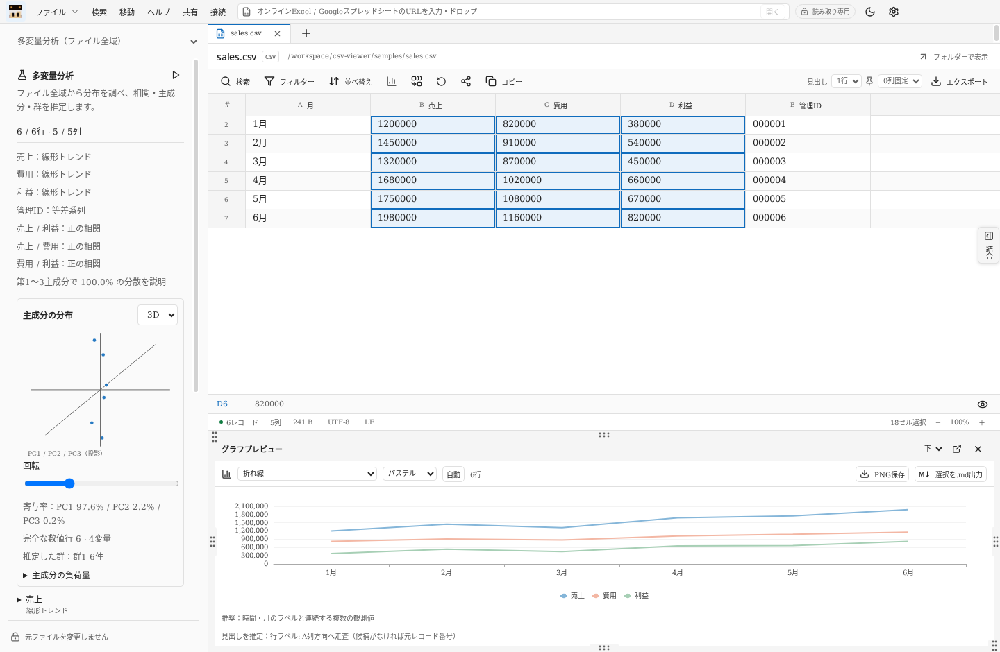

# CSV nyaan Viewer

Windows 10 / 11（x64）向けの読み取り専用CSV・Excel・Markdown・TXTビューワーです。ファイルを直接開き、閲覧中は内容・文字コード・改行・更新日時を変更しません。エクスポートだけが別ファイルへの変換を行います。

## Windowsで起動

配布ファイルは [GitHub Releases](https://github.com/BLIMP-B/csv-nyaan-viewer/releases/latest) の「Assets」から取得できます。Windows版ZIP・ソースZIP・SHA-256チェックサムを用意しています。

1. `CSV-nyaan-Viewer-1.1.5-Windows-x64.zip`を任意のフォルダーに**すべて展開**します。
2. `CSV nyaan Viewer.exe`を起動します。Node.jsのインストールは不要です。
3. 「ファイル → 開く」、Ctrl+O、またはドラッグ＆ドロップでファイルを開きます。

現在は検証環境向けの自己署名版です。公開証明書 `test-signing.cer` を同梱し、署名状態・拇印はReleasesの `SIGNATURE.json` で確認できます。他のWindows環境では、検証用証明書の手動信頼登録が必要です。手順は [Windowsコード署名](docs/code-signing.md) に記載しています。組織のWindows実行ポリシーによっては許可されない場合があります。Windows ARM64・32bit専用版は含みません。

## 機能

最上段に「左ペイン切り替え・ファイル・検索・移動・ヘルプ・共有・接続」を配置しています。URL入力欄は「接続」の右側、「読み取り専用」の左側に収めています。左ペインは「ファイル」の左のボタンで開閉します。ファイル名・パス・フォルダー表示は1列にまとめ、表の表示面積を広く取っています。

- CSV / TSV / 任意のASCII区切り文字、引用符・複数行セル、列数が不揃いなファイル。
- 先頭ゼロ、長い整数、日付らしい値、数式らしい文字列をそのまま表示。
- UTF-8、CP932、EUC-JP、UTF-16 LE/BE、UTF-32 LE/BE、Windows-1252、ISO-8859-1。自動判定と手動指定。
- 複数タブ、最近開いたファイル、検索（大文字小文字・セル一致・正規表現）、複数条件のフィルター、複数列の並べ替え、見出し行の指定・固定、列の固定・非表示・幅調整、範囲コピー、行・列への移動、全文セル表示。
- 大容量ファイルはバイト位置を索引化し、表示部分だけを読む方式。表の縦横両方向を仮想化。
- Markdownを直接プレビュー／ソース表示。TXTは引用符やカンマもそのまま表示。
- M365 / Fluentを参考にしたライト・ダーク配色。Officeブルー、Excelグリーン、Teamsパープル。プルダウンの候補、警告・エラー、グラフの軸名・ツールチップ、別ウィンドウもテーマに追従します。
- 選択範囲の数値グラフ、Ctrlによる離れた範囲の追加選択、列名・行ラベルの推定、PNG保存、選択範囲のMarkdown出力。
- 複数ファイルの範囲、テキスト、表、グラフをMarkdownのブロック文書にまとめ、ブロックごとに編集・削除。表の縦・横結合と出力／共有も可能。
- グラフプレビューは下段、結合ペインは右側が初期配置。開閉、上下左右への移動、ドット型つまみでの幅・高さ調整、別ウィンドウ化が可能。
- Google、Microsoft、GitHubのOAuth接続設定とログイン。Slack・DiscordのBot／Webhook接続。共有先にMicrosoft Teamsを追加。

配色の確認対象と検証方法は [テーマ配色の確認](docs/theme-audit.md) に記載しています。


ペイン外周の上下左右の中央と、左上・右下の計6箇所にドット型のつまみを表示します。境界全体のドラッグでもサイズを変更できます。閉じた領域には再表示ボタンが現れます。下段では上辺中央のつまみを上下に、右辺中央のつまみを左右に、左上・右下のつまみを斜めにドラッグすると、高さ・幅・両方を調整できます。表を含む結合ペインにも同じ操作が使えます。位置ごとのサイズは設定に保存され、開閉やアプリ再起動後も復元されます。つまみのダブルクリックで初期サイズに戻ります。キーボードではTabでつまみに移動し、矢印キーで調整、Shiftで大きく調整、Homeで初期サイズに戻します。別ウィンドウではウィンドウの枠をドラッグして調整します。


## グラフと複数範囲

ドラッグまたはShift+クリックで範囲を選びます。Ctrlを押して別のセルをクリックすると範囲を追加できます。その後のドラッグ／Shift操作で、追加した最後の範囲を広げます。重複する選択は二重に集計しません。

数値列は、空欄を除くセルが数値として読める列を抽出します。3桁区切り・通貨記号・%の表示値もグラフの計算時に解釈します。元のセル文字列は変更しません。縦棒・横棒・折れ線・面・円・ドーナツ・散布図・バブル・株価・等高線／サーフェス・レーダー・ツリーマップ・サンバースト・ヒストグラム・パレート・箱ひげ・ウォーターフォール・ファネル・塗り分け地図・組み合わせを選択できます。積み上げ、100%、マーカー、補助円／棒、3D表現などのバリエーションも含みます。散布図は最初の数値列をX、以降をYに使い、バブルはX・Y・大きさの3列を使います。円グラフは先頭の数値列です。離れた選択の未選択セルは空欄になり、値を捏造して補完しません。

列名は選択より上の元レコードを先頭行へ走査し、文字列候補を探します。行ラベルは左方向にA列へ走査し、文字列候補を探します。候補がなければ列記号・元レコード番号を使います。推定情報はグラフ下に表示されます。推定はデータの意味を保証しないため、共有前に確認してください。

「表示 → グラフを画像として保存」、プレビュー上のPNG保存、グラフの右クリックからPNGを保存できます。プレビューの「選択を.md出力」は元の文字列を表として出力します。グラフの近似値ではありません。

下段と右側のグラフは、X軸／Y軸の目盛りにマウスを重ねると編集範囲が表示され、そのままクリックで編集できます。軸名、数値軸の最小値・最大値・小数桁、行ラベル、系列名を指定できます。空欄の範囲は自動設定です。円・レーダー・階層・地図などのグラフには直交X/Y軸の編集領域がありません。

下段の設定はペインの移動・別ウィンドウ化でも保持されます。新しいデータ範囲を選ぶと軸設定を自動に戻します。右側に追加したグラフは、その時点のデータと設定を独立して保持し、編集内容を出力PNGにも反映します。Markdownとして保存したグラフは静止画像です。保存済み.mdを再度開いた画像からは、元データのない軸編集はできません。

Markdownプレビュー内の表も、セルをクリック／Shift選択してグラフ・結合に利用できます。

## 行・列ヘッダーの操作

中央にマウスを重ねると選択領域をハイライトします。クリックで行・列を選択し、押したまま別の見出しまでドラッグすると複数選択になります。複数選択のドラッグ終了時には「表示 / 非表示」「削除」のメニューを開きます。

見出し左側では目のアイコンで表示を切り替えます。非表示の行・列は位置と幅を保ったままグレーアウトし、値は背景との色差を抑えた文字で表示します。ライト・ダーク両方で値を確認でき、セルにマウスを重ねると全文も表示します。見出し右側では昇順・降順・元の順序のアイコンを表示します。行見出しのソートは横方向の列順を並べ替えます。

単一見出しの右クリックでは「表示 / 非表示」「ソート / フィルター」「削除」を表示します。行見出しのフィルターは、その行のセル値を使って列を絞ります。削除は表示上の操作です。「表示状態を復元」で元の行・列・順序へ戻せます。

## 自動グラフと配色

新しい選択では、時間ラベル、X/Y列名、株価の列名、割合、階層、観測間隔、値の規模・分布を用いて初期グラフを推定します。理由はプレビュー下部に表示します。プルダウンで手動変更し「自動」で推定結果に戻せます。

Office・Fluent・鮮やか・パステル・アース・色覚に配慮・ブルー濃淡の7種類のセットを選べます。配色は新しい選択でも保持します。

3DグラフはCPUによる投影・立体表現です。Excelファイル内に保存されたグラフオブジェクトやピボットグラフを再現する機能はありません。現在の塗り分け地図は国単位の世界地図です。都道府県・市区町村の地図とExcelの地理データ型には対応していません。これらはExcelとの描画・機能の差です。


## 左サイドの分析

左サイドのモードを「変量分析」「多変量分析」に切り替えます。変量分析は選択範囲を対象に、有効数・欠損・平均・中央値・四分位・標準偏差・変動係数・IQR外れ値候補・行順の回帰・1期自己相関・等差／等比／単調性を調べます。2変量のPearson相関・Spearman順位相関・線形回帰を表示します。

多変量分析はフィルターや表示削除にかかわらずファイル全域を対象にします。Excelブックでは全シートを計算し、分析結果のシートを選べます。主成分分析は完全な数値行を標準化して共分散行列を作り、Jacobi法で固有値・負荷量・寄与率を求めます。2Dと回転可能な3D投影を切り替え、決定的k-meansの群候補を色で示します。

最大5,000行・250,000セル・256列の等間隔標本です。先頭・末尾を含みます。複数シートでは全体の予算をシート数で分割します。件数と省略を表示します。相関は最大32変量、主成分は最大16変量、描画は最大500点です。因果関係・予測精度の保証は行いません。分析要約は.mdとして出力できます。



## Excelとオンラインファイル

XLSX / XLS / XLSM / XLSB / XLTX / XLTM / XLT / XLAM / XLA、およびODS / FODS / SpreadsheetML XMLを直接読み込みます。CSVへの中間変換は行いません。シートは上部のプルダウンで切り替えます。保存された表示値・書式を利用し、数式は保存済みの結果を表示します。結果のない式は式文字列を表示します。マクロ・外部リンク更新・数式再計算は実行しません。Excel側ですでに丸められた数値を元の入力精度へ復元することはできません。

最上段の「接続」と「読み取り専用」の間にある入力欄へオンラインExcel／GoogleスプレッドシートURLを入力するか、URLを画面へドロップします。公開の直接ダウンロードURL、Google Sheetsの共有URL、Google Drive内のExcel、OneDrive／SharePointの共有URLを扱います。公開取得できないファイルはGoogle／Microsoftの接続設定でログインしてください。閲覧権限とAPI有効化が必要です。

オンラインファイルは読み取り専用スナップショットとして一時保存し、タブを閉じる／正常終了時に削除します。元のURLを表示し、再読み込みで再取得します。リアルタイム同期・共同編集はありません。パスワード保護されたブック、XLWワークスペース、埋め込みグラフの再現には対応していません。Excelは256 MiB／シート500万セル以内です。

## オブザーバーとコード署名

オブザーバーは **BLINP_B(furoneko+)** です。「ヘルプ → このアプリについて」に [GitHub](https://github.com/yosu-yosu) と [ウェブサイト](https://yosuyosu.co.jp/) を掲載しています。

検証用の自己署名証明書でWindows実行ファイルへ署名し、配布前にAuthenticodeを検証します。秘密鍵は配布せず、公開証明書だけを同梱します。手順と現在の署名状態は [Windowsコード署名](docs/code-signing.md) を参照してください。Releasesの `SIGNATURE.json` に配布実行ファイルの検証結果を記録します。

## アプリアイコン

指定された画像を既定アイコンとして、Windows実行ファイル・ウィンドウ・タスクバー・左上の表示に組み込んでいます。「設定 → アプリアイコンを選択」からPNG / ICOを指定して表示を変更でき、設定は次回起動後も保持します。素材とビルド時の確認方法は [アイコン設定](assets/README.md) に記載しています。

## 変換と結合

「ファイル → エクスポート」でCSV / TSV / Markdown / TXTを選択します。CSVは全レコード、表示中のレコード、選択範囲から出力できます。選択範囲には見出しを付け、離れた範囲は行と列を合わせた表にします。未選択の交差セルは空欄です。

CSVからTXTへの出力はタブ区切り、Markdownへの出力は表です。見出し指定がないMarkdown出力では先頭レコードを表の見出しとして扱います。グレーアウトによる非表示は表示だけの操作で、出力には値が含まれます。表示から削除した行・列や横方向フィルターは表示／選択の出力に反映し、「元ファイルの全レコード」では元のデータを出力します。

Markdown / TXT間ではソースの内容を保持します。TXTからCSV / TSVへは各行を1セルとして出力します。MarkdownからCSV / TSVへは最初の表を選ぶか、各ソース行を1セルとして出力できます。表だけを出力する場合、他の文章や後続の表は含みません。

結合ペインは、テキスト・表・グラフをブロックとして並べるMarkdown文書です。「選択」「ファイル」で開いているファイルから追加し、「テキスト」「グラフ」で説明文や現在のグラフを追加します。右上の横向きトグルでプレビュー／.md原文を切り替えます。テキスト・表の内容にマウスを重ねると対象が表示され、クリックで直接編集できます。各ブロック右上の「…」にマウスを重ねると、ペン（編集）とゴミ箱（削除）が表示されます。クリックやキーボードフォーカスでも開けます。ブロック下部の矢印で順序を変更できます。

「.mdを保存」で文書を保存すると、グラフは `文書名-assets` フォルダーにPNGとして保存されます。文書を移動・共有するときは.mdと画像フォルダーを一緒に扱ってください。このアプリで開き直すと同じフォルダー内の画像を表示します。

「表をまとめて結合・出力」を開くと、表ブロックだけを従来の表形式で結合できます。縦結合は列位置または同じ見出しで合わせ、横結合は行位置で合わせます。同名見出しの重複は出現順で区別します。足りない行・列は空欄です。追加後は並べ替え・削除できます。結合はメモリ内のスナップショットで、アプリ終了時には消えます。

## 共有の初期設定

最上段の「接続」を開いて登録します。初期状態にはOAuthクライアント情報やトークンを含みません。アプリ登録が必要です。

接続手順・サービスごとの共有内容は [接続ガイド](docs/connections.md) を参照してください。メールは添付付き下書きを作成し、チャットの直接共有は画面で指定した宛先へ投稿します。ブロック文書は.md本文と画像をZIPにまとめて共有できます。Sheets／Excelは表だけ、GitHub Gistは.md本文だけを共有します。ブラウザ／アプリで開く方法は自動アップロードとは異なります。

## ショートカット

| キー | 操作 |
| --- | --- |
| Ctrl+O | 開く |
| Ctrl+F / F3 / Shift+F3 | 検索 / 次 / 前 |
| Ctrl+G | 行・列に移動 |
| Ctrl+C / Ctrl+A | コピー / 全選択 |
| Shift+クリック・矢印 | 範囲拡張 |
| Ctrl+クリック | 離れた範囲を追加 |
| Ctrl+矢印 / Ctrl+Shift+矢印 | 連続データの端へ移動 / 範囲を拡張 |
| Ctrl+Space / Shift+Space | 列 / 行を選択 |
| Home / End / Ctrl+Home / Ctrl+End | 行端 / 表の先頭・末尾 |
| PageUp / PageDown / Tab / Enter | ページ / 次の列・行へ移動 |
| Ctrl+R / Ctrl+W | 再読み込み / タブを閉じる |
| Ctrl+Shift+E | エクスポート |
| Ctrl+Shift+L | ライト・ダーク切り替え |
| F1 | 操作ガイド |

## 開発・ビルド

Node.js 22以降（検証環境は24）、npmを使用します。

```sh
npm ci
npm run build
npm test
npm run start
npm run test:ui
npm run dist:win
```

`test:ui`は画面環境が必要です。LinuxではXvfbで実行します。Windowsビルドは`release/CSV-nyaan-Viewer-1.1.5-Windows-x64.zip`になります。GitHub ActionsのWindows用ワークフローも同梱しています。

## 検証範囲と上限

コア／共有API契約／Excel・分析・全グラフ描画テスト61件、Electron UIテスト18件。実接続の検証には利用者のOAuth登録・アカウントが必要です。この作業環境ではLinuxでZIPを生成し、テストしています。GitHub Releases版はWindows runnerでテスト・生成する構成で、結果は [Actions](https://github.com/BLIMP-B/csv-nyaan-viewer/actions) で確認できます。Windows実機での手動起動は検証していません。

100万レコード、約40.9 MiBの日本語CSVで索引生成約0.60秒、末尾10行の取得約1 ms、10万件へのフィルター＋数値ソート約2.27秒を測定しました。これは本環境の参考値です。詳細は [ベンチマーク結果](docs/benchmark.json) を参照してください。

- 1レコード64 MiB、Markdown全体プレビュー16 MiB。
- グラフは先頭10,000セルまでをプレビュー。省略がある場合は表示します。
- 結合への1回の追加100,000セル、結合全体1,000,000セル。追加内容16 Mi文字。
- コピーは単一範囲1,000,000セル・16 Mi文字、複数範囲100,000セル。
- Markdown文書500ブロック・32 MiB（画像は別ファイル）。
- 追加選択100範囲、フィルター30条件、並べ替え8列、見出し30行、固定10列。
- 直接共有8 MiB以内。API側には別の容量・権限・レート制限があります。
- グラフは浮動小数点を使用します。15桁を超える数値は近似の注意を表示します。読み込みと出力では文字列を保持します。
- MarkdownのHTML実行、外部画像の取得、埋め込みリンクの自動移動は行いません。同じ文書フォルダー内の相対パス画像は読み取り専用で表示します（1画像16 MiB以内・先頭50画像まで）。
- 並べ替え・フィルターは全レコードの読み取りが必要で、ファイルサイズ・選択列に応じてCPUとメモリを使用します。

Modern CSVとは独立した実装です。通信制限により現行Modern CSV無料版の公式機能一覧を照合できていないため、**「無料版の全機能を網羅」とはまだ断定できません**。実装範囲と未照合項目は [機能対応表](docs/features.md) に記載しています。
