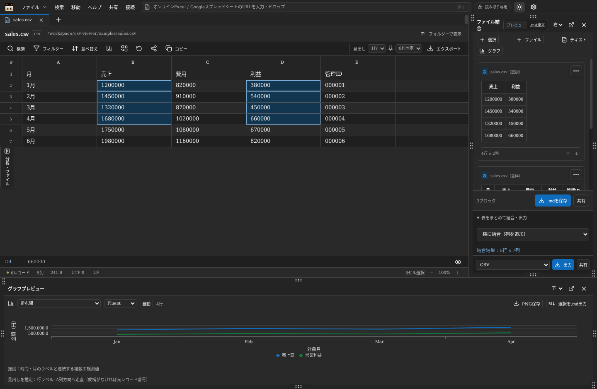
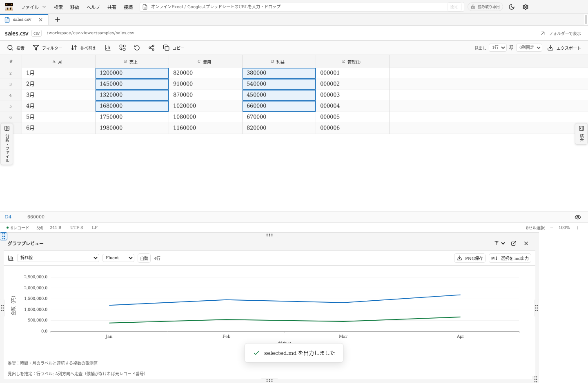
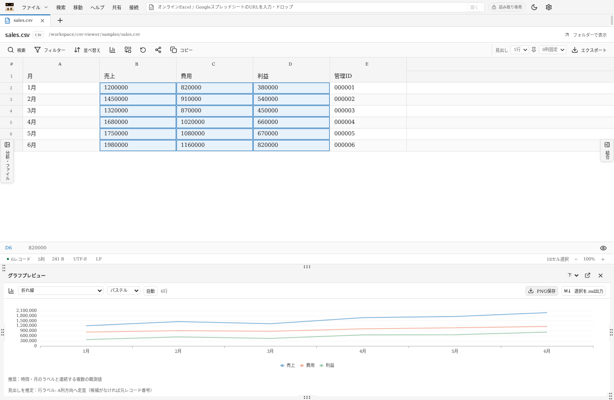
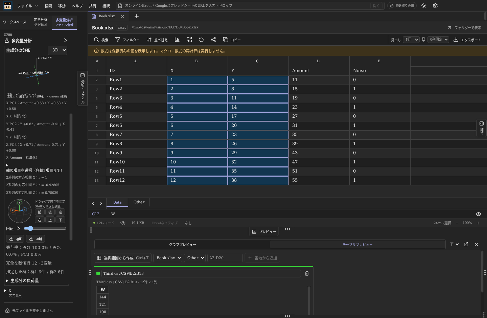

# CSV nyaan Viewer

Windows 10 / 11（x64）向けの読み取り専用CSV・Excel・Markdown・TXTビューワーです。ファイルを直接開き、閲覧中は内容・文字コード・改行・更新日時を変更しません。エクスポートだけが別ファイルへの変換を行います。

## Windowsで起動

配布ファイルは [GitHub Releases](https://github.com/BLIMP-B/csv-nyaan-viewer/releases/latest) の「Assets」から取得できます。Windows版ZIP・ソースZIP・SHA-256チェックサムを用意しています。

1. `CSV-nyaan-Viewer-1.5.4-Windows-x64.zip`を任意のフォルダーに**すべて展開**します。
2. `CSV nyaan Viewer.exe`を起動します。Node.jsのインストールは不要です。
3. 「ファイル → 開く」、Ctrl+O、またはドラッグ＆ドロップでファイルを開きます。

現在は検証環境向けの自己署名版です。公開証明書 `test-signing.cer` を同梱し、署名状態・拇印はReleasesの `SIGNATURE.json` で確認できます。他のWindows環境では、検証用証明書の手動信頼登録が必要です。手順は [Windowsコード署名](docs/code-signing.md) に記載しています。組織のWindows実行ポリシーによっては許可されない場合があります。Windows ARM64・32bit専用版は含みません。

## 機能

最上段に「左ペイン切り替え・ファイル・検索・移動・ヘルプ・共有・接続・S共有・Sアカウント接続」を配置しています。URL入力欄は「Sアカウント接続」の右側に収め、接続済みアカウントのアイコンをテーマ切り替えボタンの左に表示します。左ペインは「ファイル」の左のボタンで開閉します。ファイル名・パス・フォルダー表示は1列にまとめ、表の表示面積を広く取っています。

- CSV / TSV / 任意のASCII区切り文字、引用符・複数行セル、列数が不揃いなファイル。
- 先頭ゼロ、長い整数、日付らしい値、数式らしい文字列をそのまま表示。
- UTF-8、CP932、EUC-JP、UTF-16 LE/BE、UTF-32 LE/BE、Windows-1252、ISO-8859-1。自動判定と手動指定。
- 複数タブ、最近開いたファイル、検索（大文字小文字・セル一致・正規表現）、複数条件のフィルター、複数列の並べ替え、見出し行の指定・固定、列の固定・非表示・幅調整、範囲コピー、行・列への移動、全文セル表示。
- 複数シートのExcel・オンラインブックはデータ領域の下端に全シートのタブを表示。クリック、左右矢印、Home / Endで切り替え、横スクロールで長い一覧も閲覧できます。選択中のシートは強調表示し、シートごとに範囲選択・フィルター・ソート・非表示・固定列・列幅などの表示条件を保持し、そのシートに戻った際に復元します。
- 大容量ファイルはバイト位置を索引化し、表示部分だけを読む方式。表の縦横両方向を仮想化。
- Markdownを直接プレビュー／ソース表示。TXTは引用符やカンマもそのまま表示。
- M365 / Fluentを参考にしたライト・ダーク配色。Officeブルー、Excelグリーン、Teamsパープル。プルダウンの候補、警告・エラー、グラフの軸名・ツールチップ、別ウィンドウもテーマに追従します。
- 選択範囲の数値グラフ、Ctrlによる離れた範囲の追加選択、列名・行ラベルの推定、PNG保存、選択範囲のMarkdown出力。
- 複数ファイルの範囲、テキスト、表、グラフをMarkdownのブロック文書にまとめ、ブロックごとに編集・削除。表の縦・横結合と出力／共有も可能。
- 全6ペインを独立したタブとして扱い、境界のタブ名ボタンを上下左右へドラッグして移動・結合・並べ替えできます。グラフプレビューとテーブルプレビューも別々のタブです。
- Google、Microsoft、GitHubのOAuth接続設定とログイン。Slack・DiscordのBot／Webhook接続。共有先にMicrosoft Teamsを追加。
- 「Sアカウント接続」の内部ブラウザでGoogle・Microsoft・GitHub・Slack・Discordにログインし、「S共有」で選択範囲・元ファイル全体・結合文書を共有できます。TeamsはMicrosoftの接続を使い、ウェブとアプリ起動を選べます。添付・送信はサービス画面で確認します。

初期配置は「ワークスペース・変量分析・多変量分析」が左、「グラフプレビュー・テーブルプレビュー」が下、「ファイル結合」が右です。境界に並ぶタブ名のボタンをつかみ、表示された上下左右の結合先か既存のペインへドロップすると、同じ位置のタブグループに入ります。別のタブ上にドロップすると、その直前に並べ替えます。Escでドラッグを取り消せます。

ペイン内部のタブ列を廃止し、上下左右それぞれの境界に、共通の開閉アイコン1個とタブ名のボタンを分けて並べます。閉じている場合はどちらからでも、その側の全タブをまとめて展開します。開いている場合はタブ名で内容を切り替え、共通アイコンまたは見出しの×で領域全体を最小化します。同じ領域の一部だけを閉じたボタンがデータ領域に浮くことはありません。旧版の部分開閉設定は領域単位へ移行します。別の側の領域は開閉に影響しません。

位置・並び順・領域の開閉状態・選択中のタブは再起動後も復元します。移動・切り替え・開閉では分析の軸や回転、表の名前、結合文書の編集中の内容を保持します。一時テーブル・結合文書は従来どおりアプリ終了時に消えます。選択タブを強調し、長い名前は省略してマウスオーバーで全文を表示します。タブ名にフォーカスして上下左右矢印・Home・Endでも切り替えられます。別ウィンドウ化は同じ位置のグループ単位で行い、ウィンドウ内でも同じ境界ボタンで切り替えられます。

配色の確認対象と検証方法は [テーマ配色の確認](docs/theme-audit.md) に記載しています。



ペイン外周の上下左右の中央と、左上・右下の計6箇所にドット型のつまみを表示します。境界全体のドラッグでもサイズを変更できます。閉じた領域には再表示ボタンが現れます。境界に接したペイン内側の共通アイコンで領域全体を最小化できます。既存の見出しの×ボタンも利用できます。境界のボタンは上下左右への移動に追随し、ドット型つまみと重ならない位置に表示します。下段では上辺中央のつまみを上下に、右辺中央のつまみを左右に、左上・右下のつまみを斜めにドラッグすると、高さ・幅・両方を調整できます。表を含む結合ペインにも同じ操作が使えます。位置ごとのサイズは設定に保存され、開閉やアプリ再起動後も復元されます。つまみのダブルクリックで初期サイズに戻ります。キーボードではTabでつまみに移動し、矢印キーで調整、Shiftで大きく調整、Homeで初期サイズに戻します。別ウィンドウではウィンドウの枠をドラッグして調整します。



## グラフと複数範囲

ドラッグまたはShift+クリックで範囲を選びます。Ctrlを押して別のセルをクリックすると範囲を追加できます。その後のドラッグ／Shift操作で、追加した最後の範囲を広げます。重複する選択は二重に集計しません。

数値列は、空欄を除くセルが数値として読める列を抽出します。3桁区切り・通貨記号・%の表示値もグラフの計算時に解釈します。元のセル文字列は変更しません。縦棒・横棒・折れ線・面・円・ドーナツ・散布図・バブル・株価・等高線／サーフェス・レーダー・ツリーマップ・サンバースト・ヒストグラム・パレート・箱ひげ・ウォーターフォール・ファネル・塗り分け地図・組み合わせを選択できます。積み上げ、100%、マーカー、補助円／棒、3D表現などのバリエーションも含みます。散布図は最初の数値列をX、以降をYに使い、バブルはX・Y・大きさの3列を使います。円グラフは先頭の数値列です。離れた選択の未選択セルは空欄になり、値を捏造して補完しません。

列名は選択より上の元レコードを先頭行へ走査し、文字列候補を探します。行ラベルは左方向にA列へ走査し、文字列候補を探します。候補がなければ列記号・元レコード番号を使います。推定情報はグラフ下に表示されます。推定はデータの意味を保証しないため、共有前に確認してください。

「表示 → グラフを画像として保存」、プレビュー上のPNG保存、グラフの右クリックからPNGを保存できます。プレビューの「選択を.md出力」は元の文字列を表として出力します。グラフの近似値ではありません。

出力画像は、画面がダークモードでも白基調が初期設定です。「設定 → 出力画像の配色」で「白基調」「ダーク」「画面に合わせる」を選べます。PNG・GIFと、分析のMarkdown／XLSX・結合文書の埋め込みグラフに共通で適用します。グラフのカラーセットと軸設定は保持します。

分析画像は縦横比を保ち、タイトル・軸名・凡例の表示領域を分けます。長い名前は折り返し、領域に収まらない部分は省略記号で表示します。完全な項目名は分析本文・表・描画データに保持します。XLSXは画像の寸法から配置サイズと必要な行数を計算し、次のグラフとの間隔を確保します。埋め込むグラフはPNGの静止画像です。

下段と右側のグラフは、X軸／Y軸の目盛りにマウスを重ねると編集範囲が表示され、そのままクリックで編集できます。軸名、数値軸の最小値・最大値・小数桁、行ラベル、系列名を指定できます。空欄の範囲は自動設定です。円・レーダー・階層・地図などのグラフには直交X/Y軸の編集領域がありません。

下段の設定はペインの移動・別ウィンドウ化でも保持されます。新しいデータ範囲を選ぶと軸設定を自動に戻します。右側に追加したグラフは、その時点のデータと設定を独立して保持し、編集内容を出力PNGにも反映します。Markdownとして保存したグラフは静止画像です。保存済み.mdを再度開いた画像からは、元データのない軸編集はできません。

Markdownプレビュー内の表も、セルをクリック／Shift選択してグラフ・結合に利用できます。

## 行・列ヘッダーの操作

最上段にはA・B・C…の列記号だけを表示します。ファイル内の見出しはその下に行番号1から独立した行として表示し、複数の見出し行も個別に表示します。見出し行数0では最初のレコードから通常のデータセルになります。見出しが多い場合は見出し部分を独立してスクロールでき、データ領域を確保します。見出しセルもダブルクリックで全文確認・コピーができます。

中央にマウスを重ねると選択領域をハイライトします。クリックで行・列を選択し、押したまま別の見出しまでドラッグすると複数選択になります。複数選択のドラッグ終了時には「表示 / 非表示」「削除」のメニューを開きます。

見出し左側では目のアイコンで表示を切り替えます。非表示の行・列は位置と幅を保ったままグレーアウトし、値は背景との色差を抑えた文字で表示します。ライト・ダーク両方で値を確認でき、セルにマウスを重ねると全文も表示します。見出し右側では昇順・降順・元の順序のアイコンを表示します。行見出しのソートは横方向の列順を並べ替えます。

単一見出しの右クリックでは「表示 / 非表示」「ソート / フィルター」「削除」を表示します。行見出しのフィルターは、その行のセル値を使って列を絞ります。削除は表示上の操作です。「表示状態を復元」で元の行・列・順序へ戻せます。

## 自動グラフと配色

新しい選択では、時間ラベル、X/Y列名、株価の列名、割合、階層、観測間隔、値の規模・分布を用いて初期グラフを推定します。理由はプレビュー下部に表示します。プルダウンで手動変更し「自動」で推定結果に戻せます。

Office・Fluent・鮮やか・パステル・アース・色覚に配慮・ブルー濃淡の7種類のセットを選べます。配色は新しい選択でも保持します。

3DグラフはCPUによる投影・立体表現です。Excelファイル内に保存されたグラフオブジェクトやピボットグラフを再現する機能はありません。現在の塗り分け地図は国単位の世界地図です。都道府県・市区町村の地図とExcelの地理データ型には対応していません。これらはExcelとの描画・機能の差です。



## 左サイドの分析

左サイドのタブを「変量分析」「多変量分析」に切り替えます。変量分析は選択範囲を対象にし、グレー表示の行・列、表示から削除した行・列、フィルターで除外したデータを参照しません。有効数・欠損・平均・分散・中央値・四分位・標準偏差・変動係数・歪度・IQR外れ値候補・表示順の回帰・1期自己相関・等差／等比／単調性を調べます。2変量のPearson相関・Spearman順位相関・線形回帰も表示します。法則が認められた個別項目を展開するとグラフが現れ、個別にPNG保存できます。

多変量分析は次のラジオボタンで集計元を選びます。

- **分析シート**：現在のファイルの全シートを計算し、プルダウンで表示対象を切り替えます。セルの選択がなくても計算し、3組以上の有効データがあり、相関係数または順位相関の絶対値が0.7以上の組合せと、それに含まれる変量を表示します。このモードは元のファイルから表の範囲を推定して分析し、表示条件を無視します。異なる測定項目が縦に並ぶ比較表は、項目別に切り替えられます。
- **選択範囲を集計**：開いている複数ファイル・複数シートの明示的な選択をまとめます。範囲・表示条件はシートごとに保持し、非表示の行・列を除外します。指定した範囲の数値列と組合せを広く表示します。Escでそのシートの選択を解除できます。
- **すべてを集計**：▷を押したときだけ、開いている全ファイル・全シートの元データから集計します。ファイルを追加した後は再実行してください。
- **指定テーブルから集計**：一時保存したテーブルをチェックボックスで指定して計算します。元ファイルを閉じてもスナップショットを参照でき、指定したテーブルの数値列と組合せを広く表示します。

多変量分析では、ID・番号・コード、日付・年月・四半期、分類・クラスターなどの見出しを識別し、数値でも測定変量から自動除外します。連番という理由だけで測定値を除外しません。文章と数値が混在し、数値が80%未満の列も自動除外します。空欄・代表的なExcelエラー・未計算の数式はこの比率の文章に数えません。定数と欠損は相関・主成分の計算条件で扱います。

「自動判断・ユーザー設定」で自動除外・同名列の自動合流を変更できます。「対象・除外・合流の判断結果」に表の範囲、照合キー、除外理由を表示し、列ごとの「分析に含める」と同名列ごとの合流をチェックボックスで指定できます。「自動判断に戻す」で個別指定を解除します。これらは開いている分析画面の設定です。「分析に含める」は相関・主成分の変量設定で、照合キーは別に使用します。

Excelの全域分析は、値・数式のあるセルを使って範囲を絞り、複数段の見出し、空列や数値注記で区切られた別表を推定します。店舗などの識別子と期間を持つ横持ちの数値表は、分析時だけ観測ごとの表に展開します。元のセル・ファイルは変更しません。測定項目が異なる行は項目別に比較します。ファイル名・シート名による専用の判定はありません。推定が合わない場合は、必要な範囲やCtrl＋Tのテーブルを明示してください。

共通の行名があれば、名前と同名行の出現順で対応させます。店舗などの識別子と期間があれば複合キーを優先し、異なる年月を店舗名だけで対応させません。年月・四半期・日付・店舗・集計群などの観測単位が異なる集計元は別グループに分けます。名前も複合キーも対応できない範囲は先頭から同じ行位置で対応させます。照合キーが欠けた行は、複合キー結合で無理に一致させません。

同名列は重複する行の値が一致する場合に合流します。値が食い違う列は上書きせず、集計元の名前を付けた別系列にします。標本だけでは全データの値の一致を確認できないため、サンプリングされた集計元の同名列も別系列に保持します。対応方法・合流数・不一致数・集計元を結果に表示します。不足する末尾は空欄です。結合に使う名前と観測単位は推定なので、表示された条件を確認してください。

主成分分析は完全な数値行を標準化し、共分散行列の固有値・負荷量・寄与率を求めます。2D・3DともX/Y軸、3DではZ軸も表示し、軸名は向きに追従します。PC1〜PC3と元データの列を各軸最大2項目選び、2系列を線で比較できます。元列も平均0・標準偏差1に標準化します。PCの説明は負荷量が大きい元の変量を表示するもので、固定のカテゴリーを保証するものではありません。

グラフ内の「PCと色の見方」には、1点が表す観測、PCの概要、現在の群／系列の色の凡例を表示します。「PC1・PC2・PC3とファイル処理・算出方法」を開くと、実際の寄与率と未算出PC、読み取りと名前による対応付け、自動除外・合流の設定、欠損行の除外、標本標準偏差による標準化、Jacobi法による固有値分解、座標・係数・寄与率の計算、k-meansによる群分けと描画の間引きを確認できます。群の色は最初の最大3主成分で推定した傾向を表し、2系列比較時には系列の色へ切り替わります。群の件数は描画標本ではなく完全な数値行の件数です。この解説と凡例は折りたたんでいても多変量分析のMD・XLSX出力に含みます。

3Dホイールのドラッグで水平・垂直方向、Shift＋ドラッグで傾きを指定します。前後・左右・上下のプリセットと矢印キーも利用できます。回転バーはこの向きに追加する水平回転です。回転横の▷／停止ボタンで自動回転を開始／停止します。

2DはPNG保存、3DはGIF・OBJ出力に対応します。GIFは現在の向きから水平に2周する73フレームの有限アニメーションです。OBJの点は、元の3D座標を中心とする球体メッシュです。半径は座標の最大絶対値の2.5%（基準値の下限は1）とし、読み込んだ3Dソフトでも点の大きさを保持します。矢印付きのX・Y・Z軸と、選択中のPC／列名を示す立体文字も同じOBJに含めます。日本語の軸名は出力時にアプリのフォントで形状化し、読み込み先にフォントや外部画像を用意する必要はありません。長い軸名は折り返し、12行を超える部分は省略記号にし、完全な名前はOBJ内のコメントに保持します。表示で系列線を有効にした場合は元座標を結ぶ線も出力します。カメラの向きは焼き込まず、OBJ側で視点を変更できます。ファイル名には各軸の項目を付けます。

「分析を.md出力」「分析を.xlsx出力」は、画面の折りたたみ状態に関係なく、表示対象の全統計・相関・法則のグラフを展開済みの内容として出力します。変量分析の出力には多変量の主成分・群を含めません。多変量分析には表示中の主成分・寄与率・負荷量・群・軸設定、対象・除外・合流の判断理由とユーザー設定も含みます。MDはグラフをPNGとして埋め込み、1ファイルで持ち運べます。XLSXは分析結果・グラフ画像・描画データの3シートを含みます。グラフはPNG画像で、Excelの編集可能なチャートオブジェクトではありません。

各観測・項目の分析は最大5,000行・250,000セル・256列の標本、相関は最大64変量、主成分は最大16変量、描画は最大500点／系列です。既定の相関表示は3組以上を対象とし、8組未満は参考値であることを表示します。全域は先頭・末尾を含む等間隔標本です。Excel・保存テーブル、および10万行以内のCSV範囲ではキーの対応を先に確認してから抽出します。さらに大きいCSVは取得した標本内で照合します。集計元が多い場合は列数の予算を分割し、省略を表示します。相関・群分けは因果関係や予測精度を保証しません。繰り返し観測・群平均・派生指標には独立性や重複の確認が必要です。

## 一時テーブル

範囲を選択してCtrl＋Tを押すと、下段の「テーブルプレビュー」に一時保存します。作成順に固有色を付け、元の行・列番号を使ってグリッドにも表示するため、並べ替え後も同じデータを示します。離れた選択の未選択セルは空欄になり、色も付きません。非表示のセルは作成時に除外します。

名前はプレビュー内で変更でき、空欄のままフォーカスを外すと「ファイル名|シート名|セル範囲」に戻ります。ファイル・シートを選び、A2:D20のような元ファイル上のセル番地からも追加できます。この操作は現在開いているシートを変更しません。プレビューのゴミ箱、または色付きセルの右クリックメニューで削除します。

テーブルは作成時の値のスナップショットです。元データの再読み込みやその後の表示条件変更は内容に反映しません。1回100,000セル、合計1,000,000セル・256個までで、アプリ終了時に消えます。プレビュー表示は先頭50行・30列に制限し、分析は保存した内容全体から標本化します。



## Excelとオンラインファイル

XLSX / XLS / XLSM / XLSB / XLTX / XLTM / XLT / XLAM / XLA、およびODS / FODS / SpreadsheetML XMLを直接読み込みます。CSVへの中間変換は行いません。複数シートはデータ領域下端のタブで切り替えます。保存された表示値・書式を利用し、数式は保存済みの結果を表示します。結果のない式は式文字列を表示します。マクロ・外部リンク更新・数式再計算は実行しません。Excel側ですでに丸められた数値を元の入力精度へ復元することはできません。

最上段のURL入力欄へオンラインExcel／GoogleスプレッドシートURLを入力するか、URLを画面へドロップします。公開の直接ダウンロードURL、Google Sheetsの共有URL、Google Drive内のExcel、OneDrive／SharePointの共有URLを扱います。公開取得できないファイルは既存の「接続」でGoogle／Microsoftにログインしてください。S内部ブラウザのログインはAPIによるファイル取得には使用しません。閲覧権限とAPI有効化が必要です。

オンラインファイルは読み取り専用スナップショットとして一時保存し、タブを閉じる／正常終了時に削除します。元のURLを表示し、再読み込みで再取得します。リアルタイム同期・共同編集はありません。パスワード保護されたブック、XLWワークスペース、埋め込みグラフの再現には対応していません。Excelは256 MiB／シート500万セル以内です。

## オブザーバーとコード署名

オブザーバーは **BLINP_B(furoneko+)** です。「ヘルプ → このアプリについて」に [GitHub](https://github.com/yosu-yosu) を掲載しています。

検証用の自己署名証明書でWindows実行ファイルへ署名し、配布前にAuthenticodeを検証します。秘密鍵は配布せず、公開証明書だけを同梱します。手順と現在の署名状態は [Windowsコード署名](docs/code-signing.md) を参照してください。Releasesの `SIGNATURE.json` に配布実行ファイルの検証結果を記録します。

## アプリアイコン

指定された画像を既定アイコンとして、Windows実行ファイル・ウィンドウ・タスクバー・左上の表示に組み込んでいます。「設定 → アプリアイコンを選択」からPNG / ICOを指定して表示を変更でき、設定は次回起動後も保持します。素材とビルド時の確認方法は [アイコン設定](assets/README.md) に記載しています。

## 変換と結合

「ファイル → エクスポート」でCSV / TSV / Markdown / TXTを選択します。CSVは全レコード、表示中のレコード、選択範囲から出力できます。選択範囲には見出しを付け、離れた範囲は行と列を合わせた表にします。未選択の交差セルは空欄です。

CSVからTXTへの出力はタブ区切り、Markdownへの出力は表です。見出し指定がないMarkdown出力では先頭レコードを表の見出しとして扱います。グレーアウトによる非表示は表示だけの操作で、出力には値が含まれます。表示から削除した行・列や横方向フィルターは表示／選択の出力に反映し、「元ファイルの全レコード」では元のデータを出力します。

Markdown / TXT間ではソースの内容を保持します。TXTからCSV / TSVへは各行を1セルとして出力します。MarkdownからCSV / TSVへは最初の表を選ぶか、各ソース行を1セルとして出力できます。表だけを出力する場合、他の文章や後続の表は含みません。

結合ペインは、テキスト・表・グラフをブロックとして並べるMarkdown文書です。「選択」「ファイル」で開いているファイルから追加し、「テキスト」「グラフ」で説明文や現在のグラフを追加します。右上の横向きトグルでプレビュー／.md原文を切り替えます。テキスト・表の内容にマウスを重ねると対象が表示され、クリックで直接編集できます。各ブロック右上の「…」にマウスを重ねると、ペン（編集）とゴミ箱（削除）が表示されます。クリックやキーボードフォーカスでも開けます。ブロック下部の矢印で順序を変更できます。

「.mdを保存」で文書を保存すると、グラフは `文書名-assets` フォルダーにPNGとして保存されます。文書を移動・共有するときは.mdと画像フォルダーを一緒に扱ってください。このアプリで開き直すと同じフォルダー内の画像を表示します。

「表をまとめて結合・出力」を開くと、表ブロックだけを従来の表形式で結合できます。縦結合は列位置または同じ見出しで合わせ、横結合は行位置で合わせます。同名見出しの重複は出現順で区別します。足りない行・列は空欄です。追加後は並べ替え・削除できます。結合はメモリ内のスナップショットで、アプリ終了時には消えます。

## 共有の初期設定

「Sアカウント接続」はOAuthアプリ登録情報なしで内部ブラウザを開きます。サービス画面でログイン後、「このログインを使用」を押すとアカウントアイコンに反映します。「S共有」で用意したファイルは、サービスの添付・アップロードで確認して選択できます。自動送信は行いません。Googleなどが組み込みブラウザの認証を制限する場合は、既存の「接続」を利用してください。

アイコンをクリックするとログアウト確認を表示します。S接続と既存API接続が両方ある場合は、解除する接続をチェックボックスで選べます。Sログアウトはそのサービス群のブラウザ保存情報を消去し、既存のOAuth登録設定、他サービス、外部ブラウザ・アプリのログインは保持します。サービス群ごとに1つのブラウザ接続を管理します。

アカウント欄は登録数1〜5件でスクロールバーを表示せず、取得できた本人のプロフィール画像を丸く表示します。画像なし・取得失敗・権限不足の場合は各サービスのアイコンを表示します。S接続では本人のアカウントボタンの画像だけを取り込み、投稿・メンバー一覧などの画像を参照しません。画像は次回起動時も保持し、内部ブラウザの「画像を更新」で再取得できます。旧版で登録したS接続はサービス画面を再び開くと画像の取得を試みます。既存API接続ではGoogle・Microsoft・GitHub、本人参照権限のあるSlackユーザートークンから取得を試みます。Slack／DiscordのBot・Webhookはユーザー画像の対象外です。

従来のAPIによる共有は最上段の「接続」を開いて登録します。初期状態にはOAuthクライアント情報やトークンを含みません。こちらはアプリ登録が必要です。

接続手順・サービスごとの共有内容は [接続ガイド](docs/connections.md) を参照してください。メールは添付付き下書きを作成し、チャットの直接共有は画面で指定した宛先へ投稿します。ブロック文書は.md本文と画像をZIPにまとめて共有できます。Sheets／Excelは表だけ、GitHub Gistは.md本文だけを共有します。ブラウザ／アプリで開く方法は自動アップロードとは異なります。

## ショートカット

| キー | 操作 |
| --- | --- |
| Ctrl+O | 開く |
| Ctrl+F / F3 / Shift+F3 | 検索 / 次 / 前 |
| Ctrl+G | 行・列に移動 |
| Ctrl+C / Ctrl+A | コピー / 全選択 |
| Shift+クリック・矢印 | 範囲拡張 |
| Ctrl+クリック | 離れた範囲を追加 |
| Ctrl+矢印 / Ctrl+Shift+矢印 | 連続データの端へ移動 / 範囲を拡張 |
| Ctrl+T | 選択範囲から一時テーブルを作成 |
| Ctrl+Space / Shift+Space | 列 / 行を選択 |
| Home / End / Ctrl+Home / Ctrl+End | 行端 / 表の先頭・末尾 |
| PageUp / PageDown / Tab / Enter | ページ / 次の列・行へ移動 |
| Ctrl+R / Ctrl+W | 再読み込み / タブを閉じる |
| Ctrl+Shift+E | エクスポート |
| Ctrl+Shift+L | ライト・ダーク切り替え |
| F1 | 操作ガイド |

## 開発・ビルド

Node.js 22以降（検証環境は24）、npmを使用します。

```sh
npm ci
npm run build
npm test
npm run start
npm run test:ui
npm run dist:win
```

`test:ui`は画面環境が必要です。LinuxではXvfbで実行します。Windowsビルドは`release/CSV-nyaan-Viewer-1.5.4-Windows-x64.zip`になります。GitHub ActionsのWindows用ワークフローも同梱しています。

## 検証範囲と上限

コア／共有API契約／Excel・分析・全グラフ描画テスト120件、Electron UIテスト36件。OBJは球体の中心・半径・閉じた形状・面の向き・頂点参照、矢印付き軸・日本語の軸名メッシュを確認します。S内部ブラウザの操作・セッション保存・消去・ファイル選択・権限制限は架空のサービス画面で検証します。実サービスのログイン・送信は未検証で、各サービスの認証制限や組織設定に依存します。既存API接続の検証には利用者のOAuth登録・アカウントが必要です。GitHub Releases版はWindows runnerでテスト・生成する構成で、結果は [Actions](https://github.com/BLIMP-B/csv-nyaan-viewer/actions) で確認できます。Windows実機での手動起動は検証していません。

100万レコード、約40.9 MiBの日本語CSVで索引生成約0.60秒、末尾10行の取得約1 ms、10万件へのフィルター＋数値ソート約2.27秒を測定しました。これは本環境の参考値です。詳細は [ベンチマーク結果](docs/benchmark.json) を参照してください。

- 1レコード64 MiB、Markdown全体プレビュー16 MiB。
- グラフは先頭10,000セルまでをプレビュー。省略がある場合は表示します。
- 結合への1回の追加100,000セル、結合全体1,000,000セル。追加内容16 Mi文字。
- コピーは単一範囲1,000,000セル・16 Mi文字、複数範囲100,000セル。
- Markdown文書500ブロック・32 MiB（画像は別ファイル）。
- 追加選択100範囲、フィルター30条件、並べ替え8列、見出し30行、固定10列。
- 直接共有8 MiB以内。API側には別の容量・権限・レート制限があります。
- S共有ファイル32 MiB以内、文書500ブロック以内。本文コピーは最大4 Mi文字。サービス側にも添付サイズ・権限の制限があります。
- グラフは浮動小数点を使用します。15桁を超える数値は近似の注意を表示します。読み込みと出力では文字列を保持します。
- MarkdownのHTML実行、外部画像の取得、埋め込みリンクの自動移動は行いません。同じ文書フォルダー内の相対パス画像は読み取り専用で表示します（1画像16 MiB以内・先頭50画像まで）。
- 並べ替え・フィルターは全レコードの読み取りが必要で、ファイルサイズ・選択列に応じてCPUとメモリを使用します。

実装機能と検証状況は [機能一覧](docs/features.md) に記載しています。
