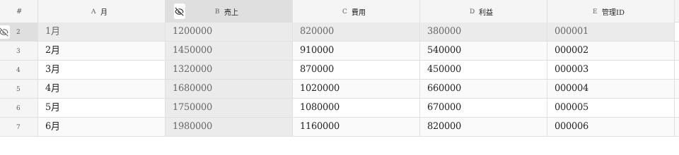
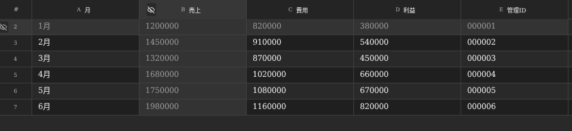
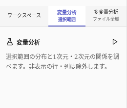
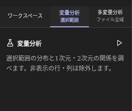

# テーマ配色の確認（v1.1.4 / v1.1.5 / v1.1.8）

2026年10月2日、画面を構成するReactコンポーネント、共通CSS、グラフ描画設定、Electronのウィンドウ・設定処理を横断して確認しました。

| 対象 | 確認した問題と変更 |
| --- | --- |
| 全プルダウン | 選択肢の背景が透明だったため、Windowsで白いポップアップに薄い文字が表示される場合がありました。`option`・`optgroup`にテーマの背景・文字色を明示しました。 |
| リンク・選択見出し・編集ヒント | ダークモードのアクセント文字は、背景とのコントラストが約2.7:1でした。文字用の色を分け、3種類のアクセントそれぞれを明るく補正しました。ボタンの塗り色は各プロファイルの色です。 |
| 補足文字・入力欄の案内 | ライトモードの補足文字を濃くし、プレースホルダーにもテーマの文字色を明示しました。 |
| 警告・エラー・削除・成功表示 | 固定されたライト配色を共通テーマ変数に置き換え、ダークモード用の背景・文字・アイコン色を追加しました。 |
| グラフ | 軸名の色が軸線の暗い色を継承していました。軸名、ツールチップ、凡例のページ表示、円・ファネル等のラベルに配色を明示しました。階層・3Dの重ね文字には縁取りを追加しました。縮小時に重なる目盛りを間引き、軸名と凡例の余白も調整しました。 |
| 分析図 | 軸線が未定義の`--border`を参照していました。定義済みの色に修正し、群の点にもテーマ別の色を用意しました。 |
| 別ウィンドウ | 配色とアクセントがメインウィンドウの変更に追従することを確認しました。 |
| Windowsのネイティブ表示 | `nativeTheme.themeSource`を保存済みのテーマと変更操作へ同期させました。起動時のウィンドウ背景もテーマに合わせました。 |

## 検証

`tests/theme.spec.ts`では、Officeブルー・Excelグリーン・Teamsパープルとライト／ダークの組み合わせを実際のElectron画面で確認します。メニュー、設定、表・ヘッダー、結合ペイン、フィルター、並べ替え、エクスポート、ヘルプ、アプリ情報、共有、接続設定、警告、エラー、軸編集、分析、グラフのツールチップ、別ウィンドウを対象にしています。

描画された文字・入力欄の案内文字は背景色に合成してコントラストを測定し、通常の文字は4.5:1以上、大きい文字は3:1以上を確認します。無効化された操作と描画されないセルは対象から除きます。v1.1.5のグレーアウトしたセルは値を表示し、通常の文字と同じコントラスト確認の対象です。

既存のUIテストでも、プルダウン候補とグループ見出しの背景が不透明で読みやすいこと、別ウィンドウを開いたままライト→ダーク→ライトに変更して配色が追従することを確認します。全83種類のグラフの描画テストは両テーマで実行します。

これらを含むコアテスト77件、Electron UIテスト24件をWindows配布ワークフローでも実行し、アイコンとAuthenticode署名を検証してから配布します。

## v1.1.5：非表示セルの値表示

非表示の行・列も値を読み取れるよう、透明文字と子要素の非表示を廃止しました。背景はテーマのグレー色、文字はライトで`#696969`、ダークで`#9d9d9d`を使います。通常セルより色差を小さくしながら、約4.6:1のコントラストを確保します。

全3アクセント×両テーマで、行・列それぞれと交差部分の値表示、通常表示への復元をUIテストで確認します。

## v1.1.8：左サイドのモードタブ

ワークスペース・変量分析・多変量分析を常時表示するタブに変更しました。背景・文字・補足・下線・フォーカス枠には共通のテーマ変数を使用します。全3アクセント×両テーマで、各モードの文字と分析結果のコントラストを確認します。

## v1.2.0：分析と一時テーブル

新しい集計ラジオボタン・軸選択・3Dホイール・自動回転・出力ボタン、テーブルプレビューと色付きセルを全3アクセント×両テーマで確認します。図と出力画像は共通のテーマ変数から文字・背景・系列色を取得します。
